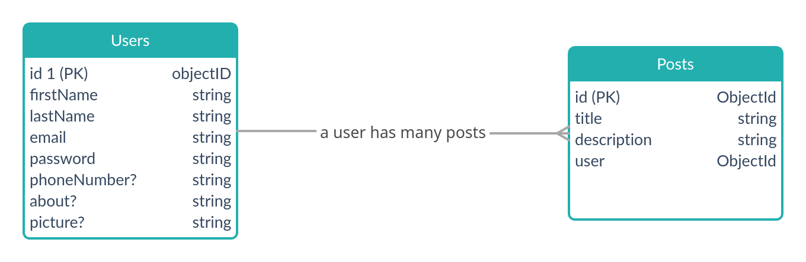

## Node-ts-assignment

This project was bootstrapped with [nodejs](https://nodejs.org/en/).

## About this project

- This project is for practice only
- The idea is to get more comfortable with the usage of typescript and to realise its benefits
- Another aspect is to understand the way typescript can be used to augment the usage of mongoose/mongo models

## Requirements

- [Node Js v14](https://nodejs.org/en/download)
- [MongoDb v5](https://www.mongodb.com/try/download/community)

## SDK's Used in this project

- [Mongoose](https://mongoosejs.com)
- [Express](https://expressjs.com/)
-

## Installation Instructions

- Globally install nodejs
  --inorder to enable you machine to run javascript

```bash
sudo apt install nodejs
```

- Globally install mongodb (https://docs.mongodb.com/manual/installation/)
  --Inorder to work with a NOSQL database

## Setup Instructions

Clone the repo and install the dependencies.

```bash
npm install
```

```bash
Create .env file in the project root
```

```bash
Add these credentials in .env file
PORT=7000

```

## Running on local

To start the server, run the following

```bash
npm run dev
```

## Documentation

See the collection for documentation:

- navigate to localhost:7000 in your browser after running run command

## Architecture Diagram


## Database Design


